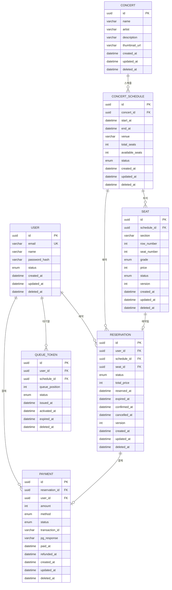

# 콘서트 예매 시스템 ERD

## 1. 주요 도메인

| 도메인            | 설명                      |
| ----------------- | ------------------------- |
| 사용자(User)      | 회원 정보 및 인증         |
| 콘서트(Concert)   | 공연 정보 관리            |
| 좌석(Seat)        | 좌석 배치 및 등급 관리    |
| 예약(Reservation) | 티켓 예매 및 임시 점유    |
| 결제(Payment)     | 결제 처리 및 이력         |
| 대기열(Queue)     | 트래픽 제어를 위한 대기열 |

---

## 2. ERD 다이어그램



---

## 3. 테이블 상세 설계

### 3.1 사용자 (users)

| 컬럼명        | 타입         | 제약조건                   | 설명                                   |
| ------------- | ------------ | -------------------------- | -------------------------------------- |
| id            | UUID         | PK                         | 고유 식별자                            |
| email         | VARCHAR(255) | UNIQUE, NOT NULL           | 이메일 (로그인 ID)                     |
| name          | VARCHAR(100) | NOT NULL                   | 사용자 이름                            |
| password_hash | VARCHAR(255) | NOT NULL                   | 암호화된 비밀번호                      |
| status        | ENUM         | NOT NULL, DEFAULT 'ACTIVE' | 계정 상태 (ACTIVE, SUSPENDED, DELETED) |
| created_at    | DATETIME     | NOT NULL                   | 생성일시                               |
| updated_at    | DATETIME     | NOT NULL                   | 수정일시                               |
| deleted_at    | DATETIME     | NULL                       | 삭제일시 (Soft Delete)                 |

**인덱스**

- `idx_users_email`: email (UNIQUE)
- `idx_users_status`: status
- `idx_users_deleted_at`: deleted_at (삭제되지 않은 레코드 필터링)

---

### 3.2 콘서트 (concerts)

| 컬럼명        | 타입         | 제약조건 | 설명                   |
| ------------- | ------------ | -------- | ---------------------- |
| id            | UUID         | PK       | 고유 식별자            |
| name          | VARCHAR(200) | NOT NULL | 콘서트명               |
| artist        | VARCHAR(200) | NOT NULL | 아티스트/출연자        |
| description   | TEXT         | -        | 상세 설명              |
| thumbnail_url | VARCHAR(500) | -        | 썸네일 이미지 URL      |
| created_at    | DATETIME     | NOT NULL | 생성일시               |
| updated_at    | DATETIME     | NOT NULL | 수정일시               |
| deleted_at    | DATETIME     | NULL     | 삭제일시 (Soft Delete) |

**인덱스**

- `idx_concerts_name`: name
- `idx_concerts_artist`: artist
- `idx_concerts_deleted_at`: deleted_at

---

### 3.3 콘서트 스케줄 (concert_schedules)

| 컬럼명          | 타입         | 제약조건                     | 설명                                     |
| --------------- | ------------ | ---------------------------- | ---------------------------------------- |
| id              | UUID         | PK                           | 고유 식별자                              |
| concert_id      | UUID         | FK, NOT NULL                 | 콘서트 ID                                |
| start_at        | DATETIME     | NOT NULL                     | 공연 시작 시간                           |
| end_at          | DATETIME     | NOT NULL                     | 공연 종료 시간                           |
| venue           | VARCHAR(200) | NOT NULL                     | 공연장                                   |
| total_seats     | INT          | NOT NULL                     | 총 좌석 수                               |
| available_seats | INT          | NOT NULL                     | 예약 가능 좌석 수                        |
| status          | ENUM         | NOT NULL, DEFAULT 'UPCOMING' | 상태 (UPCOMING, OPEN, CLOSED, CANCELLED) |
| created_at      | DATETIME     | NOT NULL                     | 생성일시                                 |
| updated_at      | DATETIME     | NOT NULL                     | 수정일시                                 |
| deleted_at      | DATETIME     | NULL                         | 삭제일시 (Soft Delete)                   |

**인덱스**

- `idx_schedules_concert_id`: concert_id
- `idx_schedules_start_at`: start_at
- `idx_schedules_status`: status
- `idx_schedules_deleted_at`: deleted_at

---

### 3.4 좌석 (seats)

| 컬럼명      | 타입        | 제약조건                      | 설명                                |
| ----------- | ----------- | ----------------------------- | ----------------------------------- |
| id          | UUID        | PK                            | 고유 식별자                         |
| schedule_id | UUID        | FK, NOT NULL                  | 스케줄 ID                           |
| section     | VARCHAR(50) | NOT NULL                      | 구역 (A, B, C 등)                   |
| row_number  | INT         | NOT NULL                      | 열 번호                             |
| seat_number | INT         | NOT NULL                      | 좌석 번호                           |
| grade       | ENUM        | NOT NULL                      | 등급 (VIP, R, S, A)                 |
| price       | INT         | NOT NULL                      | 가격                                |
| status      | ENUM        | NOT NULL, DEFAULT 'AVAILABLE' | 상태 (AVAILABLE, HOLDING, RESERVED) |
| version     | INT         | NOT NULL, DEFAULT 0           | 낙관적 락 버전                      |
| created_at  | DATETIME    | NOT NULL                      | 생성일시                            |
| updated_at  | DATETIME    | NOT NULL                      | 수정일시                            |
| deleted_at  | DATETIME    | NULL                          | 삭제일시 (Soft Delete)              |

**인덱스**

- `idx_seats_schedule_id`: schedule_id
- `idx_seats_status`: status
- `idx_seats_composite`: (schedule_id, section, row_number, seat_number) UNIQUE
- `idx_seats_deleted_at`: deleted_at

> [!IMPORTANT]
> **동시성 제어**: `version` 컬럼을 통한 **낙관적 락(Optimistic Lock)** 적용. 좌석 선점 시 버전 충돌 감지로 동시 예약 방지.

---

### 3.5 예약 (reservations)

| 컬럼명       | 타입     | 제약조건                    | 설명                                          |
| ------------ | -------- | --------------------------- | --------------------------------------------- |
| id           | UUID     | PK                          | 고유 식별자                                   |
| user_id      | UUID     | FK, NOT NULL                | 사용자 ID                                     |
| schedule_id  | UUID     | FK, NOT NULL                | 스케줄 ID                                     |
| seat_id      | UUID     | FK, NOT NULL                | 좌석 ID                                       |
| status       | ENUM     | NOT NULL, DEFAULT 'PENDING' | 상태 (PENDING, CONFIRMED, EXPIRED, CANCELLED) |
| total_price  | INT      | NOT NULL                    | 총 결제 금액                                  |
| reserved_at  | DATETIME | NOT NULL                    | 임시 예약 시간                                |
| expired_at   | DATETIME | NOT NULL                    | 임시 예약 만료 시간                           |
| confirmed_at | DATETIME | -                           | 예약 확정 시간                                |
| cancelled_at | DATETIME | -                           | 취소 시간                                     |
| version      | INT      | NOT NULL, DEFAULT 0         | 낙관적 락 버전                                |
| created_at   | DATETIME | NOT NULL                    | 생성일시                                      |
| updated_at   | DATETIME | NOT NULL                    | 수정일시                                      |
| deleted_at   | DATETIME | NULL                        | 삭제일시 (Soft Delete)                        |

**인덱스**

- `idx_reservations_user_id`: user_id
- `idx_reservations_schedule_id`: schedule_id
- `idx_reservations_seat_id`: seat_id (UNIQUE)
- `idx_reservations_status`: status
- `idx_reservations_expired_at`: expired_at (만료 예약 조회용)
- `idx_reservations_deleted_at`: deleted_at

> [!NOTE]
> **임시 예약**: 좌석 선택 시 5분간 임시 점유 (`PENDING` 상태). 결제 완료 전 만료 시 자동 해제.

---

### 3.6 결제 (payments)

| 컬럼명         | 타입         | 제약조건                    | 설명                                        |
| -------------- | ------------ | --------------------------- | ------------------------------------------- |
| id             | UUID         | PK                          | 고유 식별자                                 |
| reservation_id | UUID         | FK, NOT NULL                | 예약 ID                                     |
| user_id        | UUID         | FK, NOT NULL                | 사용자 ID                                   |
| amount         | INT          | NOT NULL                    | 결제 금액                                   |
| method         | ENUM         | NOT NULL                    | 결제 수단 (CARD, KAKAO_PAY, NAVER_PAY)      |
| status         | ENUM         | NOT NULL, DEFAULT 'PENDING' | 상태 (PENDING, COMPLETED, FAILED, REFUNDED) |
| transaction_id | VARCHAR(100) | -                           | PG사 거래 ID                                |
| pg_response    | JSON         | -                           | PG사 응답 원문                              |
| paid_at        | DATETIME     | -                           | 결제 완료 시간                              |
| refunded_at    | DATETIME     | -                           | 환불 시간                                   |
| created_at     | DATETIME     | NOT NULL                    | 생성일시                                    |
| updated_at     | DATETIME     | NOT NULL                    | 수정일시                                    |
| deleted_at     | DATETIME     | NULL                        | 삭제일시 (Soft Delete)                      |

**인덱스**

- `idx_payments_reservation_id`: reservation_id (UNIQUE)
- `idx_payments_user_id`: user_id
- `idx_payments_transaction_id`: transaction_id
- `idx_payments_status`: status
- `idx_payments_deleted_at`: deleted_at

---

### 3.7 대기열 토큰 (queue_tokens)

| 컬럼명         | 타입     | 제약조건                    | 설명                            |
| -------------- | -------- | --------------------------- | ------------------------------- |
| id             | UUID     | PK                          | 고유 식별자                     |
| user_id        | UUID     | FK, NOT NULL                | 사용자 ID                       |
| schedule_id    | UUID     | FK, NOT NULL                | 스케줄 ID                       |
| queue_position | INT      | NOT NULL                    | 대기 순번                       |
| status         | ENUM     | NOT NULL, DEFAULT 'WAITING' | 상태 (WAITING, ACTIVE, EXPIRED) |
| issued_at      | DATETIME | NOT NULL                    | 토큰 발급 시간                  |
| activated_at   | DATETIME | -                           | 활성화 시간 (입장 시점)         |
| expired_at     | DATETIME | NOT NULL                    | 만료 시간                       |
| deleted_at     | DATETIME | NULL                        | 삭제일시 (Soft Delete)          |

**인덱스**

- `idx_queue_user_schedule`: (user_id, schedule_id) UNIQUE
- `idx_queue_schedule_position`: (schedule_id, queue_position)
- `idx_queue_status`: status
- `idx_queue_deleted_at`: deleted_at

> [!TIP]
> **대기열 시스템**: 인기 콘서트 예매 시 트래픽 폭주 방지를 위한 가상 대기열. Redis Sorted Set 활용 고려.

---

## 4. ENUM 정의

```sql
-- 사용자 상태
CREATE TYPE user_status AS ENUM ('ACTIVE', 'SUSPENDED', 'DELETED');

-- 스케줄 상태
CREATE TYPE schedule_status AS ENUM ('UPCOMING', 'OPEN', 'CLOSED', 'CANCELLED');

-- 좌석 등급
CREATE TYPE seat_grade AS ENUM ('VIP', 'R', 'S', 'A');

-- 좌석 상태
CREATE TYPE seat_status AS ENUM ('AVAILABLE', 'HOLDING', 'RESERVED');

-- 예약 상태
CREATE TYPE reservation_status AS ENUM ('PENDING', 'CONFIRMED', 'EXPIRED', 'CANCELLED');

-- 결제 수단
CREATE TYPE payment_method AS ENUM ('CARD', 'KAKAO_PAY', 'NAVER_PAY', 'TOSS');

-- 결제 상태
CREATE TYPE payment_status AS ENUM ('PENDING', 'COMPLETED', 'FAILED', 'REFUNDED');

-- 대기열 상태
CREATE TYPE queue_status AS ENUM ('WAITING', 'ACTIVE', 'EXPIRED');
```

---

## 5. 예상 문제점 및 해결 방향

### 5.1 동시성 이슈

| 문제               | 상황                                     | 해결 방향                                     |
| ------------------ | ---------------------------------------- | --------------------------------------------- |
| **동시 좌석 선점** | 동일 좌석에 여러 사용자가 동시 예약 시도 | 낙관적 락(version) + 데이터베이스 유니크 제약 |
| **재고 불일치**    | available_seats 감소 시 동시성 문제      | 비관적 락 또는 Redis 분산 락 적용             |
| **결제 중복**      | 동일 예약에 대한 중복 결제 요청          | 멱등성 키(Idempotency Key) 적용               |

> [!CAUTION]
> **테스트 포인트**: 고부하 상황(10,000+ 동시 요청)에서 좌석 중복 예약 발생 여부 검증 필요

---

### 5.2 분산 환경 이슈

| 문제            | 상황                       | 해결 방향                             |
| --------------- | -------------------------- | ------------------------------------- |
| **분산 락**     | 다중 서버 환경에서 락 관리 | Redis 기반 분산 락 (Redlock 알고리즘) |
| **세션 공유**   | 서버 간 세션 불일치        | Redis Session Store 또는 JWT 토큰     |
| **캐시 일관성** | 캐시 데이터와 DB 불일치    | Cache-Aside 패턴 + TTL 관리           |

---

### 5.3 성능 이슈

| 문제               | 상황                             | 해결 방향                         |
| ------------------ | -------------------------------- | --------------------------------- |
| **트래픽 폭주**    | 예매 오픈 시 순간 트래픽 급증    | 대기열 시스템 + Rate Limiting     |
| **조회 성능**      | 좌석 현황 조회 시 부하           | Redis 캐싱 + 읽기 전용 복제본     |
| **DB 커넥션 고갈** | 동시 요청 증가 시 커넥션 풀 부족 | 커넥션 풀 최적화 + PgBouncer 도입 |

---

### 5.4 데이터 정합성 이슈

| 문제                 | 상황                               | 해결 방향                               |
| -------------------- | ---------------------------------- | --------------------------------------- |
| **임시 예약 만료**   | PENDING 상태 예약의 자동 만료 처리 | 스케줄러 기반 배치 처리 + 이벤트 드리븐 |
| **결제-예약 불일치** | 결제 성공 후 예약 확정 실패        | 사가(Saga) 패턴 + 보상 트랜잭션         |
| **외부 PG 연동**     | PG사 응답 지연/실패                | 재시도 로직 + 타임아웃 관리 + 폴백      |

> [!WARNING]
> **핵심 시나리오**: 결제 완료 후 시스템 장애 발생 시 데이터 정합성 보장 방안 필수

---

## 6. 테스트 시나리오

### 6.1 부하 테스트

- [ ] 좌석 선점 동시성 테스트 (k6, Artillery)
- [ ] 대기열 처리량 테스트
- [ ] DB 커넥션 풀 최대치 테스트

### 6.2 장애 테스트

- [ ] Redis 장애 시 폴백 동작 확인
- [ ] DB 장애 시 서비스 가용성 확인
- [ ] PG사 타임아웃 시 롤백 동작 확인

### 6.3 데이터 정합성 테스트

- [ ] 임시 예약 만료 스케줄러 동작 확인
- [ ] 결제-예약 상태 동기화 확인
- [ ] 동시 예약 시 중복 방지 확인

---

## 7. 참고 자료

- [ADR-002: Prisma ORM 선택](file:///Users/723poil/git/side/concert-booking/docs/ARCHITECTURE_DECISIONS.md)
- [ADR-003: MySQL 데이터베이스 선택](file:///Users/723poil/git/side/concert-booking/docs/ARCHITECTURE_DECISIONS.md)
