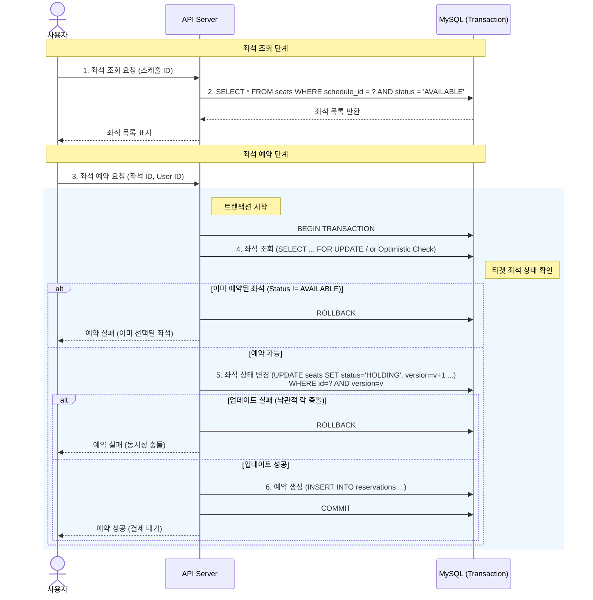

# 콘서트 좌석 예약 시나리오 (Reservation Scenario)

## 1. 개요

이 문서는 사용자가 콘서트 좌석을 선택하고 예약을 요청했을 때의 시스템 흐름을 정의합니다.
MySQL의 트랜잭션을 사용하여 데이터 일관성을 보장하는 것을 목표로 하며, 동시성 제어를 위한 전략을 포함합니다.

## 2. 주요 흐름 (Flow)

### 2.1 좌석 조회 (Seat Lookup)

1. 사용자가 콘서트 날짜(스케줄)를 선택합니다.
2. 시스템은 해당 스케줄의 **예약 가능한 좌석(AVAILABLE)** 목록을 반환합니다.
   - _참고_: 동시성 테스트를 위해 캐싱 없이 DB에서 직접 조회합니다.

### 2.2 좌석 예약 (Seat Reservation)

1. 사용자가 특정 좌석을 선택하여 예약을 요청합니다.
2. **[트랜잭션 시작]**
3. 해당 좌석의 최신 상태를 조회합니다.
   - 이미 예약된 좌석(RESERVED/HOLDING)인 경우 예외 처리.
4. 좌석의 상태를 '임시 배정(HOLDING)'으로 변경합니다.
   - **낙관적 락(Version)**을 사용하여 동시 수정 충돌을 감지합니다.
5. `Reservation` 테이블에 예약 정보를 생성합니다 (상태: PENDING).
6. **[트랜잭션 커밋]**
7. 사용자에게 예약 성공 응답을 반환합니다.

## 3. 시퀀스 다이어그램 (Sequence Diagram)

다음은 좌석 예약 요청 시의 상세 흐름입니다.

## 4. 테스트 포인트

- **동시성 충돌**: 동일한 좌석(Row)에 대해 동시에 2명 이상의 유저가 예약 요청을 보낼 때, 단 1명만 성공하고 나머지는 실패해야 함.
- **데이터 정합성**: `Seats` 테이블의 상태가 `HOLDING`으로 바뀌었을 때, 반드시 `Reservation` 테이블에 데이터가 존재해야 함.
